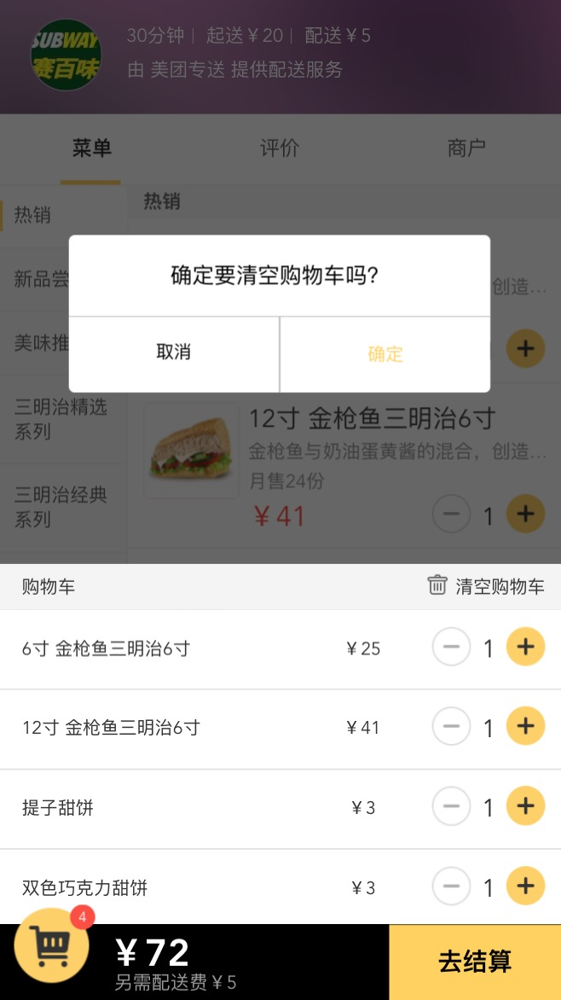
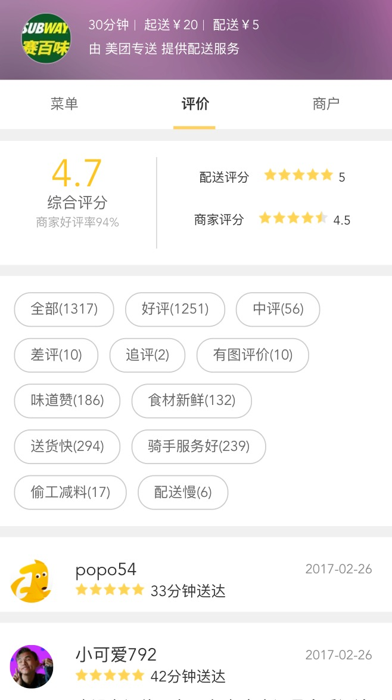

# 基于vue2+vue-router+webpack+less+es6仿美团外卖项目

> A Vue.js project

The vue project is just for fun and learning,there are still have some compatibility bug on ios device.

Still underConstruction.

DEMO: [https://hawx1993.github.io/vue-waimai](https://hawx1993.github.io/vue-waimai)

use chrome mobile device mode

## Build Setup


>install dependencies

```
$ yarn
```
>serve with hot reload at localhost:8080

```
$ npm run dev
```

>build for production with minification

```
npm run build
```

>效果



<br />



<br />


>scan it on mobile device


### TODO

- 首页
- 登陆页
- 订单页
- 评价页下拉刷新
